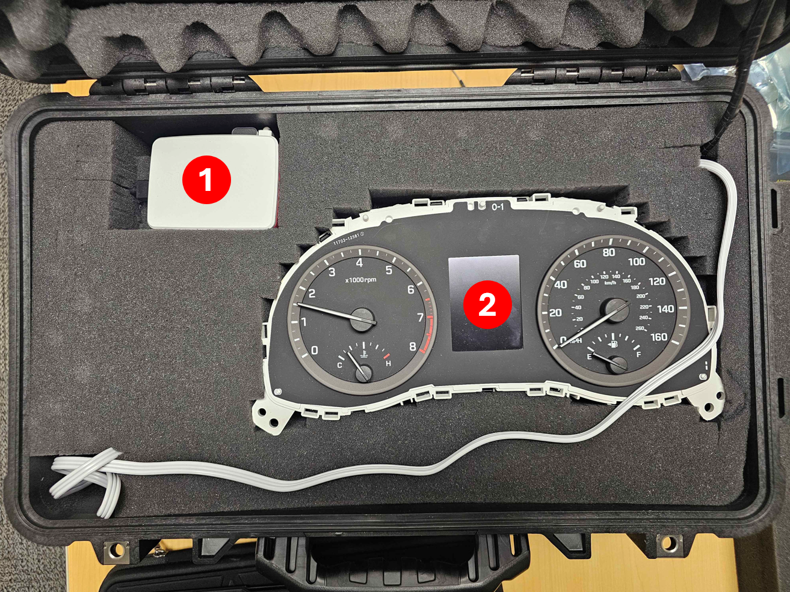
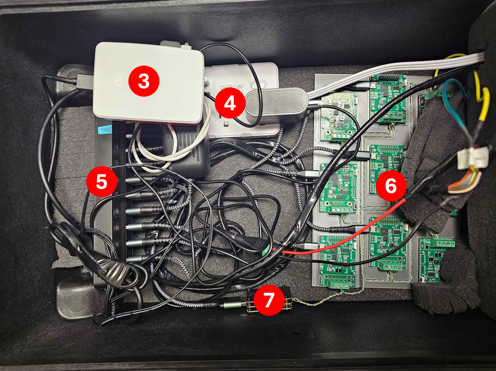

# Initial Setup

This document walks through the full setup of the CAN Testbed (CAN Testbed) environment, from wiring the hardware to preparing the software stack. The overall goal is to build a small CAN network made of nine RP2040 based boards, connect that network to a host machine using Canable style USB to CAN interface, and ensure everything is powered and reachable over USB for flashing, logging, and control.

You will do the setup in two stages:

1. **Hardware:** assemble the boards, build the CAN bus, and connect power and USB.
2. **Software:** install the backend and frontend dependencies, then verify that the host can see both the CAN adapter and the microcontrollers.

**Quick Links:**

* [Hardware Setup](#hardware-setup)
* [Assembly and Wiring](#assembly-and-wiring)
* [Software Setup](#software-setup)
* [CAN Testbed Startup Automation](#can-testbed-startup-automation)
* [Troubleshooting](#troubleshooting)

---

## Hardware Setup

### Parts List

You will need the following items to build the physical testbed:

* **1x CANable compatible USB to CAN adapter**
* **9x Longan Labs RP2040 Development Boards**
* **9x Micro USB cables**
* **1x 10 port powered USBX hub**
* **CAN wiring (twisted pair strongly recommended)**

### Purchasing and Selection Tips

A few choices here matter a lot for reliability. These notes explain what to watch out for before you plug everything in:

1. **Micro USB cables must support data + power.**
    Many cheap cables are "charge only" and will power the boards but fail to expose a serial interface. If boards appear to power on but never show up as USB devices, suspect the cable first.

2. **Use a powered hub with an external power supply.**
    Nine boards plus a CAN adapter is a lot to ask from a single laptop port. A powered hub keeps the system stable and prevents random disconnects during flashing or heavy serial activity.

3. **Use twisted pair for CANH and CANL.**
    Purpose built CAN cable is ideal, but a twisted pair pulled from CAT5e or CAT6 Ethernet cable works well. Twisted helps reduce noise and improves signal integrity across the bus.

4. **The exact CANable vendor or revision is not critical.**
    Any CANable compatible adapter should work as long as it supports the correct firmware and exposes a SocketCAN compatible interface.

5. **Firmware matters: use candleLight, not slcan.**
    This testbed assumes the CAN adapter is running **candleLight** firmware. If the adapter is using slcan, you may see different device behavior and the host tools may not work the way the project expects.

**For more deatils on the hardware, see the [Bill of Materials.](BOM.md)**

## Assembly and Wiring

### Board Preperation Overview

The RP2040 boards typically ship with optional hardware you can solder on (connectors, headers, and a termination resistor switch). For this project:

* **Required on all boards**: the **4 pin screw terminal** (used for CANH and CANL wiring).
* **Required on one board**: The **120 Ohm termination switch** (used to terminate one end of the bus).
* **Optional**: GPIO headers if you plan to connect sensors, breakout components, external triggers later.

The most important idea is that every board must be able to attach cleanly to the shared CAN bus, and the bus must be properly terminated at both ends.

### Install the 4 pin screw terminal (all 9 boards)

1. Insert the **4 pin screw terminal** into the matching through holes near the edge of the board.
2. Make sure the terminal sits flush and straight (crooked terminals are annoying later when tightening wires).
3. Solder all **four** pins on the underside of the PCB.
4. Repeat for all **nine** boards.


>Note: these terminals are your CANH and CANL connection points. A weak solder joint can cause intermittent CAN communication that looks like random "packet loss" or "buss off" behavior.

### Install and enable the 120 Ohms termination switch (only 1 board)

Only one of your nine boards needs the termination switch installed and enabled. This board will be used as the "end" of the CAN chain.

1. Insert the termination switch into the **6-hole** foohtprint near the corner of the board.
2. Solder all **six** pins.
3. Slide the switch to the **enabled** position (usually toward the edge of the board, depending on the silkscreen).


>A CAN bus is meant to be terminated with **120 Ohms at each end** of the main line. Termination reduces reflections and helps keep the signal clean, especially as the number of nodes increases.

### Wire the CAN bus between the boards

1. Locate the screw terminal positions labeled **CANH** and **CANL** on each board.
2. Choose two consistent wire colors (example: **yellow for CANH** and **green for CANL**) and stick with them for the entire chain.
3. Connect the boards in a single chain (a simple daisy chain is fine for a bench testbed):

    * Board 1 connects to Board 2
    * Board 2 connects to Board 3
    * ...
    * Board 8 connects to Board 9

4. Put the board with the termination switch at the **far end** of the chain.
5. Tighten every terminal firmly. After tightening, gently tug each wire to make sure it is clamped.

>Keep the twisted pair as twisted as possible and avoid untwisting large sections near the terminals.

### Connect USB power and data

1. Plug one Micro USB cable into each board.
2. Connect all nine cables to the powered USB hub.
3. Plug in the hub's external power supply.
4. Connect the hub's upstream USB cable to your host computer.

>Expected result: All boards should power on and enumerate as USB devices. If some boards light up but don't show up on the host, swap the cable with a known good one.


### Connecting the CANable Adapter

This adapter is the bridge between your computer and the CAN network.

1. On the CANable adapter, open the terminals labeled **CANH** and **CANL**.
2. On the first board in your chain (Board 1), open its **CANH** and **CANL** terminals.
3. Connect:

    * CANable **CANH** -> Board 1 **CANH**
    * CANable **CANL** -> Board 1 **CANL**

4. Tighten the terminal screws and verify the wires are secure.
5. Plug the CANable adapter into the powered USB hub.
6. Enable the adapter's **120 Ohm resistor** using the **R120** switch.

>With termination on the CANable side and termination on the far end board, you end up with the standard two terminated ends of the bus.

**The complete setup should look like this:**  
 <br>
1\. The Raspberry Pi 5 that runs the web app and can flash the boards.  
2\. A 2017 Hyundai Sonata dash board.
<br><br>

 <br>
3\. The Pi again.  
4\. A compact powerstrip that everything plugs into.  
5\. The 10-port USB hub that gives power to each PCB and allows them to be flashed with new code.  
6\. The PCBs that act as the ECUs in the simulation.  
7\. The CANable adapter that allows the Pi to communicate with the CAN bus.  
<br>

**Here's another example using [Trevor's](https://github.com/trevormcclellan/CAN-Testbed/wiki) Setup:**


## Software Setup
### Setting up the development environment and flashing the CANBed RP2040 boards

#### 1. First, pull the project files from the repository to your local machine
```
git clone https://github.com/trevormcclellan/CAN-Testbed
cd CAN-Testbed
```
#### 2. There are two ways to get the libraries ready
#### Automatic Setup (Arduino CLI) (Recommended):
Run the built-in dependency script. This handles the installation of arduino-cli and all required libraries (like the custom Longan Labs CANBed library) automatically. If this is the first time you run the script it will install it in the user's home directory. 

```
./rp2040/install_deps.sh
```
Note: `install_deps.sh` is located in the `rp2040` directory.

#### The Manual Route (Arduino IDE):
If you prefer using the graphical interface:
1. Follow the setup guide in the CANBed RP2040 documentation under “Getting Started with Arduino IDE”, and complete everything up through the “Download and install the library” section [See Here](https://docs.longan-labs.cc/1030018/#getting-started-with-arduino-ide)
2. Next, go to the rp2040 folder in this repository and open the CANBed.ino file using the Arduino IDE
3. In the Arduino IDE, go to Tools → Manage Libraries
4. Search for and install the following libraries:
   - ArduinoJson by Benoit Blanchon
   - ArduinoQueue by Einar Arnason


5. Then, check for the mcp_canbus library by Longan Labs. This should already be installed from the zip file in Step 1 of the manual stetup. If it is not showing up, refer back to the instructions provided [here](https://docs.longan-labs.cc/1030018/#download-the-install-the-library).
6. Finally, select the correct board by going to:
Tools → Board → Longan RP2040 Boards → CANBed 2040
If you do not see this board option listed, go back and make sure Step 1 was completed correctly


#### 3. Flash the Boards with the CANBench Firmware
#### Automatic Firmware Flashing (Arduino CLI) (Recommended) 
The easiest way to flash the boards is by using the `flash_boards.sh` script located in the `rp2040` directory. The script will compile the sketch and automatically flash it onto any CANBed RP2040 boards that are currently connected.

Run the following command to install the base CANBench firmware:

```
./rp2040/flash_boards.sh ./rp2040/CANBed/CANBed.ino
```
After running the command, you will be asked to turn on the boards you want to program. Once everything is powered on, press Enter to start the flashing process.

> **Note:** If you are reflashing the firmware later, make sure no other programs (including the web dashboard) are using the serial ports. If the dashboard is open, close the browser tab before running the script.

#### Manual Firmware Flashing (Arduino IDE)
1. Confirm that the selected board is CANBed 2040
(See Step 2 The Manual Route: Install the Arduino IDE and Libraries, instruction #5.)
2. Select the correct port for the board you are flashing
   > It may help to connect one board at a time to avoid selecting the wrong port
   > ALso make sure no other application is using the serial port (including the web dashboard). The upload will fail if the port is busy.


3. Click the Upload arrow in the top toolbar of the Arduino IDE
   >The sketch will take a few seconds to compile and upload. Once complete, the blue LED on the CANBed board should blink six times, indicating it has booted successfully


4. Disconnect or power off the current board
5. Connect the next board and select its corresponding port
6. Repeat the upload process for each remaining board

### Web Backend Set-up
### 1. Update Your System
Make sure your software is up-to-date by running:

```
sudo apt update -y && sudo apt upgrade -y
sudo mkdir TestBED
```

### 2. Getting the Repository
Clone the CAN TestBed repository:

```
sudo git clone https://github.com/trevormcclellan/CAN-TestBed
```

### 3. Preparing Installation
Check if Python 3 is installed:

```
python3 -v
```

#### 3.1 Navigate to the Backend directory:

Install Pip (if not installed):

```
sudo apt install python3-pip -y
```

#### 3.2 Install Python dependencies:

```
sudo pip install -r requirements.txt
```

> If you get an error, bypass the safety warning::

```
sudo pip install -r requirements.txt --break-system-packages
```


### Side Note — Flask Module Issues
If you get an error saying flask modules are missing, uninstall Flask:

```
sudo pip uninstall flask
```

or

```
pip uninstall flask
``` 
Then install the required modules manually:

```
pip install Flask --break-system-packages
pip install Flask_cors --break-system-packages
pip install Flask_socketio --break-system-packages
pip install can --break-system-packages
```
### 4. Run the Backend
Start the backend with:
```
python3 backend.py
```

### 5. Preparing the Web Dashboard (Frontend)

#### 5.1 Install npm
Navigate to the CAN-Frontend directory:

```
cd ../CAN-Frontend
```

Install npm:

```
sudo apt install npm
```

Install frontend packages:

```
sudo npm install
sudo npm audit fix

```
Run the frontend:

```
sudo npm run dev

```

> Note About VITE Issues:
If you encounter Vite-related errors, install newer versions of Python and Node.js.

## CAN Testbed Startup Automation

> ⚠️ IMPORTANT NOTE: Raspberry Pi 5 Specific Configuration
This documentation and the subsequent configuration review are based on the specific hardware and operating environment currently deployed on the Raspberry Pi 5 machine. The file paths and user environment settings (like $HOME/.config/autostart) are tailored for this particular setup and may require modification for other Linux distributions or Raspberry Pi models.


The provided configuration successfully automates three key components upon system boot and user login:

### 1. Chrome Kiosk Auto-Launch (GUI Autostart)
The following file is located at:

```
~/.config/autostart/can-frontend.desktop

```

can-frontend.desktop

```
[Desktop Entry]
Type=Application
Name=CAN Frontend Auto Browser
Exec=/usr/bin/chromium --kiosk --start-fullscreen --noerrdialogs --disable-infobars --disable-session-crashed-bubble http://localhost:5173
X-GNOME-Autostart-enabled=true
Terminal=false

```
**Explanation**
| Key                                   | Meaning                                                                                   |
|---------------------------------------|-------------------------------------------------------------------------------------------|
| `[Desktop Entry]`                     | Tells GNOME this is a standard application launcher.                                      |
| `Type=Application`                    | Indicates this will launch a normal application at login.                                 |
| `Name=CAN Frontend Auto Browser`      | The name that appears in GNOME Startup Applications.                                      |
| `Exec=…`                              | The command executed at login.                                                             |
| `--kiosk`                             | Launches Chromium in full locked-down kiosk mode.                                          |
| `--start-fullscreen`                  | Forces fullscreen even if kiosk mode is bypassed.                                          |
| `--noerrdialogs`                      | Prevents Chromium error popup windows.                                                     |
| `--disable-infobars`                  | Removes automation banners (“Controlled by automated software”).                          |
| `--disable-session-crashed-bubble`    | Suppresses “Restore pages?” message.                                                       |
| `http://localhost:5173`               | The frontend served locally by the dev server.                                             |
| `X-GNOME-Autostart-enabled=true`      | Automatically runs on login.                                                               |
| `Terminal=false`                      | Runs without opening a terminal window.                                                    |

This ensures the Raspberry Pi immediately opens the CAN-Frontend UI in a locked kiosk mode upon boot.

### 2. Frontend Automation (Systemd Service)
Systemd service file located at:

```
/etc/systemd/system/can-frontend.service

```

can-frontend.service

```
[Unit]
Description=CAN Testbed Frontend
After=network-online.target
Wants=network-online.target

[Service]
Type=simple
WorkingDirectory=/home/can-bus/CAN-Testbed/CAN-Frontend
ExecStart=/usr/bin/env npm run dev
Restart=on-failure
RestartSec=5
User=root

[Install]
WantedBy=multi-user.target

```

**Explanation**

| Section                  | Details                                                                      |
|--------------------------|-------------------------------------------------------------------------------|
| `After=network-online.target`   | Ensures the service starts only after the network is fully online.            |
| `Wants=network-online.target`   | Makes systemd attempt to start networking if it is not already active.       |
| `WorkingDirectory=…`            | Points to the location of the CAN Frontend project.                           |
| `ExecStart=…`                   | Runs `npm run dev` to start the Vite/Web server.                               |
| `Restart=on-failure`            | Auto-restarts the service if the process exits with an error.                 |
| `RestartSec=5`                  | Waits 5 seconds before attempting to restart.                                 |
| `User=root`                     | Runs the service as root (can be changed to `can-bus` for hardening).         |
| `WantedBy=multi-user.target`    | Enables the service to start automatically during normal multi-user boot.     |


### 3. Backend Automation (Systemd Service)
Systemd service file located at:

```
/etc/systemd/system/can-backend.service

```

can-backend.service

```
[Unit]
Description=CAN Testbed Backend
After=network-online.target

[Service]
Type=simple
WorkingDirectory=/home/can-bus/CAN-Testbed/Backend
ExecStart=/usr/bin/python3 backend.py
Restart=on-failure
RestartSec=5
User=root

[Install]
WantedBy=multi-user.target

```
**Explanation**

| Key                           | Meaning                                                                                   |
|-------------------------------|-------------------------------------------------------------------------------------------|
| `After=network-online.target` | Backend starts only after the network is confirmed online.                                |
| `WorkingDirectory`            | Points to the backend Python folder.                                                      |
| `ExecStart`                   | Runs `backend.py` using the system Python3 interpreter.                                   |
| `Restart` & `RestartSec`      | Ensures the service automatically restarts after a failure.                               |
| `User=root`                   | Runs with elevated privileges (CAN interfaces or hardware access may require root).       |
| `WantedBy=multi-user.target`  | Enables automatic startup during the normal multi-user boot process.                      |

### 4. Operational Notes
**Open a terminal**

`Ctrl + Alt + T`

**Exit Kiosk Mode (Chromium)**
1. Switch to TTY1
   `Ctrl + Alt + F1 `

2. Login:
   `Username: can-bus` `Password: Cargovr00m`

3. Kill Chromium:
   `killall chromium`

4. Return to GUI: `Ctrl + Alt + F7`

### 5. Check Service Status
**Frontend**
```
sudo systemctl status can-frontend.service
```

**Backend**
```
sudo systemctl status can-backend.service
```

### 6. Enable Services on Boot (if not already enabled)

```
sudo systemctl enable can-frontend.service
sudo systemctl enable can-backend.service
```

### 7. Start / Restart Manually

```
sudo systemctl restart can-frontend.service
sudo systemctl restart can-backend.service

```

## Troubleshooting

### Issue: Raspberry Pi 5 HDMI Output Fails After Boot

- Boot screen appears

- Once OS loads, display goes black

- Display returns only after switching HDMI ports

This happened because the Raspberry Pi attempted to auto-detect EDID and disabled HDMI when the monitor was slow to respond.

**Fix: Force HDMI Port 1 Always On**
Edit the file: `/boot/firmware/cmdline.txt`

/boot/firmware/cmdline.txt
```
video=HDMI-A-1:e

```

What this does

- Forces HDMI port 1 to stay enabled even without EDID

- Prevents the Pi from disabling HDMI during cold boot

- Stops the issue where video is lost after the OS loads

- Eliminates the need to physically switch HDMI cables

This has been confirmed to resolve the display dropout problem on Raspberry Pi 5.


### Issue: On kiosk display, scrollbars appeared due to screen resolution mismatch.

Fix:
Add the following CSS inside <head> of: `CAN-Testbed/CAN-Frontend/index.html`

CSS: Hide scrollbars
```
<head>
  <style>
    html, body {
      overflow-y: scroll;
      overflow-x: hidden;
      height: 100vh;
    }

    ::-webkit-scrollbar {
      width: 0;
      height: 0;
    }
  </style>
</head>

```
What this does

- Removes visible scrollbars in Chromium kiosk mode

- Prevents users from seeing unnecessary UI elements

- Creates a cleaner, full-screen interface

### When attempting to flash a board, you get a "Permission Denied" error
Make sure whatever linux user you are trying to setup the simulator with has permissions to manage serial ports. If you aren't using root, make sure to add your user to the 'dialout' group.
