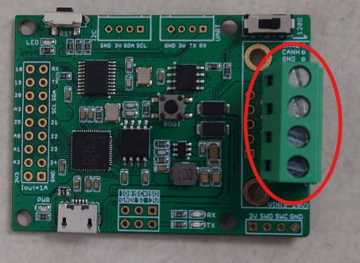
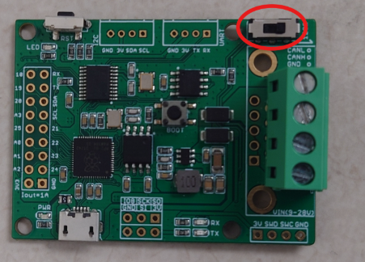
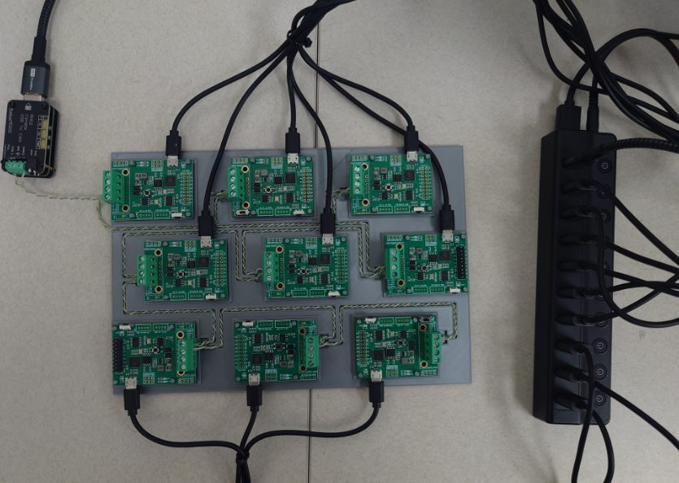

# Initial Setup 

This guide covers the necessary steps to prepare the CAN-TestBed environment. You will first configure the physical connections for the microcontrollers, followed by installing the required backend (Python) and frontend (Node.js) software.

**Quick Links:**
* [Hardware Setup](#hardware-setup)
* [Software Setup](#software-setup)

---

## Hardware Setup
To run the testbed, you require the following components:
* (1x) CANable adapter.
* (9x) Longan Labs RP2040 Development Boards
* (9x) Micro USB Cables 
* (1x) 10 Port Powered USB Hub 
* CAN Bus Wire 

> Note:
> Things to Consider when selecting these products above:
> 1. USB Cables: Use Micro USB cables that support both data transfer and power; "charging-only" cables are not suitable for serial communication.
> 2. USB Hub: Utilize a powered USB hub with an external power supply to reliably power all 10 boards simultaneously.
> 3. CAN Wiring: Use twisted pair wiring for CAN High and CAN Low (dedicated wire is best, but twisted pair from a CAT6 Ethernet cable works).
> 4. CANable Hardware: The open-source CANable board can be purchased from various sources; the exact model used here is not required.
> 5. Firmware: This project requires and utilizes the candleLight firmware, not the slcan option.


## Assembling the Components

### Board Preparation:

The CANBed Development boards come with several components that can be soldered on, including a D-Sub Connector, a 4-pin screw terminal, headers for the GPIO and SPI pins, connectors for the I2C and UART pins, and a switch for the 120Ω terminal resistor. The only component that is required for all 9 boards is the 4-pin screw terminal. At least one of the boards will need the switch for the 120Ω terminal resistor (this will be the last board in the loop). If you would like to use the GPIO pins to connect to external sensors or components, you may want to attach the GPIO headers.

### Attaching the 4-pin Screw Terminal:
1. Slide the screw terminal into the 4 holes on the edge of the board as shown.
2. Solder all 4 pins to the board. Do this for all 9 boards.
> Note: These will be used to connect all the boards to the CAN bus.



### Attaching the 120Ω Terminal Resistor Switch:

> You only need to do this on one board.

1. Slide the switch into the 6 holes in the corner of the board as shown.
2. Solder all 6 pins to the board.
3. Slide the switch toward the edge of the board to enable the 120Ω terminal resistor.

> Note: CAN bus uses a 120Ω terminal resistor at each end to ensure signal integrity and proper operation of the network.



### Connecting the Boards:

1. Open the screw terminals marked CANH and CANL on each board. These are the CAN High and CAN Low connections.
2. Connect all 9 boards in a chain, ensuring that the board with the switch is the last in the chain.

>Note: It is best to use two different colors of wire for the CAN High and CAN Low connections to ensure that they are not mixed up. The standard is to use yellow for CAN High and green for CAN Low.

3. Make sure all connections are tight.
4. Connect a Micro USB cable from each board to the USB hub
5. Plug in the USB Hub's power adapter
6. Connect the USB Hub's USB cable to your computer



### Connecting the CANable Adapter:

1. Open the screw terminals marked CANH and CANL on the CANable adapter and the first board in the chain.
2. Connect the CANable CANH and CANL terminals to the board's CANH and CANL terminals.
3. Make sure the connection is tight.
4. Plug the CANable adapter into the USB hub
5. Push the "R120" switch down to enable the 120Ω resistor
> Note: It might be more convenient to use a USB extension cable to connect the CANable adapter to the USB hub

**The Complete setup should look like this:**


## Software Setup

### Step 1: Clone the Repository
```bash
sudo git clone [https://github.com/trevormcclellan/CAN-TestBed](https://github.com/trevormcclellan/CAN-TestBed)
sudo mkdir TestBED
```
### Step 2: Install the Arduino IDE and Libraries

**Recommended: Automatic Setup (Arduino CLI)**

For most users, the easiest way to install dependencies is to use the provided setup script. The install_deps.sh is located in the rp2040 directory. This script will install arduino-cli to the user's home directory if it is not found, then install all required libraries, including the custom CANBed RP2040 library from Longan Labs. If you have the Arduino IDE installed, this script should add all of the dependencies there as well, if you would like to use it later. Run the script using the following command:

```bash
./rp2040/install_deps.sh
```
