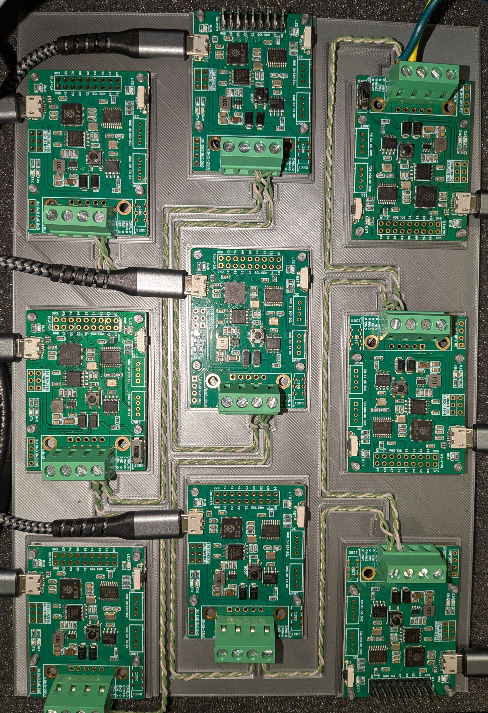
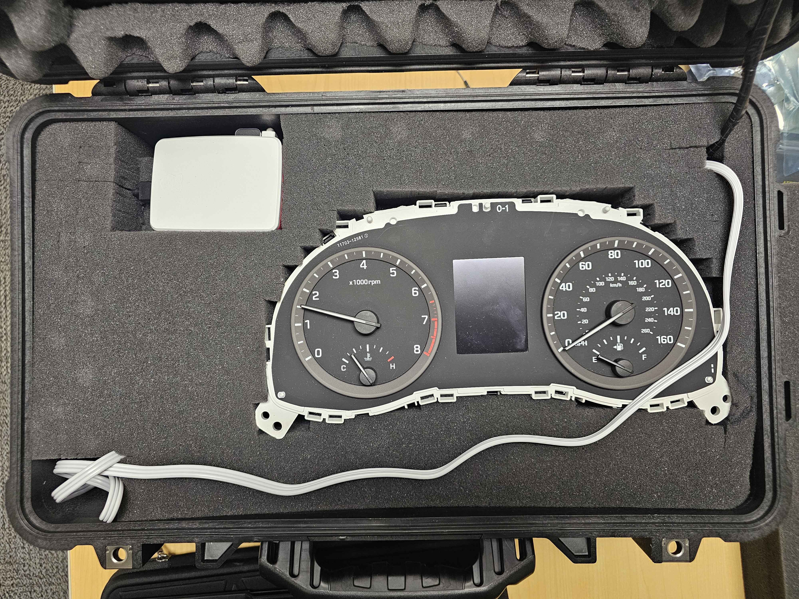

# CAN Bus Hacking Lab

## 🎯 Learning Objectives
- Understand the CAN bus and the function it performs in a vehicle.

- Demonstrate how to physically modify user-crafted messages to target specific car systems.

- Demonstrate the use of false, high-priority messages to disrupt board functions.

- Learn how to mitigate the risk of CAN bus attacks.
---
## ⚙️ SETUP

[Inital Setup](Initial-Setup.md)

>**NOTE:** These instructions are for Professors or TAs to initially configure the lab environment.
>These steps should have already been accomplished for any students starting the lab. If you are
>a student, begin with Objective 1.

## Objective 1

The CAN bus is a communication system that vehicles use to coordinate and share information between key components. The CAN bus links important systems together such as the dashboard, brakes, engine, headlights, and infotainment system. Like any other network of devices, the CAN bus can be hacked and disrupted. To attack and defend a CAN bus, you must first understand how it works.

### 📖 Required Reading & Research
Read the following article and answer the questions to show your understanding: 

https://www.csselectronics.com/pages/can-bus-simple-intro-tutorial

1. What does the acronym “CAN” stand for, and what is the primary role of a CAN bus in a vehicle or machine?

2. Describe the physical wiring of a typical CAN network—what kind of cable is used and how are the two wires named/colored (according to the article)?

3. What are the “Top 4 benefits” of using a CAN bus network, and how does each one specifically improve real-world automotive or industrial systems?

4. In the context of the seven-layer OSI model, which layers does CAN cover?

5. What is a standard CAN data frame (11-bit identifier) made up of? Name the fields and briefly state what they do.

6. Explain how arbitration works on a CAN bus (i.e., when two nodes attempt to transmit at once).

**Check out this YouTube video that shows CAN bus attacks in real time! (3:06 and on specifically talks about the CAN Bus): https://youtu.be/MK0SrxBC1xs**

## Our CAN bus lab configuration
In the photos below, you can see an example configuration of this CAN bus lab. 
- ECU (Electronic Control Unit): Acts as a small computer that controls a specific automotive system.
- PCB (Printed Circuit Board): Provides the physical mounting and electrical connections for the ECU components.

Each physical PCB can represent one or many a distinct ECUs in the simulated car. For example, one board could be the brakes ECU, another the engine ECU, and so on. The dashboard itself acts as several ECUs in one, receiving and transmitting for several different systems.

>Each of these green boards is a PCB. They are the "brains" of the CAN Bus.

>The dashboard of a car has several ECUs within it. (speedometer, tachometer, fuel gauge, etc.)

## Objective 2

### Part 1

[Instructions for uploading the test.log file](Using-the-TestBed.md#uploading-a-candump) - **Reference the section "Uploading a CANdump"**

1. Run the simulation to confirm everything is set up and operating correctly.

   - *Verification*: The dashboard should light up, and each board should show a checkmark indicating it has received all expected messages.

2. Analyze Encryption: As you’ve seen, CAN bus messages are not encrypted, making them easy to inject.

3. Perform Injection: Using the IDs and data fields you identified during the setup phase, configure a board to inject messages into the network.

4. Re-run the simulation.

**Lab Questions**:

- Did anything behave differently during the simulation?

- Do you see the messages you configured coming through?
  
-  Provide a picture showing the injected messages that were received as your answer to this question.

### Part 2
Now, you will inject a specially crafted message to attack a specific ECU: the speedometer.

To do this, you need to understand that a car’s speed is calculated from the wheels’ speed. The sensors that measure wheel speed are a part of the car’s Anti-lock Braking System (ABS). The ABS is one of the many ECUs in the car’s CAN network, and it regularly broadcasts this speed data on the CAN bus. If we can reverse engineer how these broadcast messages work, we can spoof our own messages to influence any ECUs that listen to ABS data.

#### 🧠 Understanding the Parts of a CAN Message
Keep these key points in mind while reviewing the DBC lines:

 - The DBC is designed to be human-readable, so everything is in decimal 

 - Actual CAN frames will be in hex, not decimal 

 - This DBC shows that speeds on the CAN bus are sent in km/h, so remember to convert to and from mph. 

 - We only care about the first 5 lines of this entry. The last for are for data validation, which we don’t care about in our attack. 

 - You’ll execute this attack in the same way as the injection you performed in Part 1. This time however, your message will be curated to affect the speedometer. This means **you must use the correct CAN ID and message.**

The image below shows the entry in the DBC file for the ABS of a Hyundai Sonata. This entry
breaks down the parts of an ABS CAN frame.

- Line 1 gives us the CAN ID, 902. 

- Lines 2-5 dictate the way wheel speeds are encoded into the CAN frame. 

- Lines 5-9 show how checksums/data validation is included in the frame. 

See the image below for a breakdown of what’s contained in line 2 (3-5 will be the same):

Now apply this to an actual CAN frame. 

### 🔎 Example Analysis: Speed Data Frame

Let’s break down the following CAN frame as an example:

`386#0D090D090D090D09`

1. Data Structure Every four hex digits represent the current speed of one wheel. In this frame, `0D09` is repeated four times, meaning all four wheels are traveling at the exact same speed. 

2. Endianness Correction The DBC file for this system specifies Little Endian format. To calculate the value, we must rearrange the hex digits:
   - Original: `0D09`
   - Reordered: `090D`

3. Decimal Conversion Converting the reordered hex 090D directly to decimal gives us: `2,317`

4. Applying the Scaling Factor We multiply the decimal value by the scaling factor (0.03125) to find the speed in km/h:
   - `2,317 x 0.03125 = 72.41 km/h`

5. Final Conversion (mph) To get the speed in miles per hour:
   - `72.41 x 0.621371 = 44.99 mph`
  
Conclusion: The frame `386#0D090D090D090D09` indicates the car is traveling at 45 mph.

### 🛠️ Lab Activity: Crafting a False Frame

To trick the speedometer, you must perform these steps in reverse. Follow this workflow:

1. Choose target speed in mph
2. Convert mph to km/h
3. Divide by the scaling factor (0.03125)
4. Convert the resulting decimal to Hex
5. Swap to Little Endian (rearrange the digits)
6. Format the final 16-character CAN frame.

**Your Task**: Create a CAN frame that indicates a speed of 160 mph. Use the web app to inject this frame and trick the speedometer.

**Submission**: Provide your crafted CAN frame and a photo/screenshot of the speedometer hitting 160 mph as proof

>Should see something like 386#2F202F202F202F20 or 386#8020802080208020 (remove this, this is a note for professors/TAs only)

## Objective 3

### Part 1: Denial of Service (DoS)

Finally, execute a Denial of Service (DoS) attack on the CAN bus so that most or all of the expected messages are missed by the boards.

[Insert instructions to flash a board with the DoS code]

#### 🖥️ How it Works: Network Flooding

[Perhaps insert a review of the DoS code that explains how it works, i.e. flooding the network with hi-pri messages so no other ECU can communicate] 

**Execution Steps:**
1. Flash the board: Once the board is flashed with the DoS code, power it off.
2. Baseline Test: Power on all other boards and verify that the simulation runs normally using the test_drive.log file.
3. Active Attack: Rerun the same simulation, but power the attacker board on and off at various points throughout the simulation.
4. Observation: Observe how the behavior of the dashboard changes when the attacking board is powered on.

[Insert reflection questions about how to prevent this or methods of perpetrating an attack, such as various physical access methods or internet access]

### Part 2: Security & Industry Response

[Provide link to article about encrypting CAN traffic and what car manufacturers are doing about attacks like this] 

**Final Reflection**: Reflect on how significant you think the lack of security on the CAN bus is. Consider the special impact the CAN bus’s security—or lack thereof—could have on cars connected to the internet.

**Your Task**: Write a paragraph or two explaining your thoughts on the issue of protecting the CAN bus from attacks. There is no right or wrong answer; we are looking to see that you have deeply considered the situation and have a well-formulated opinion.
